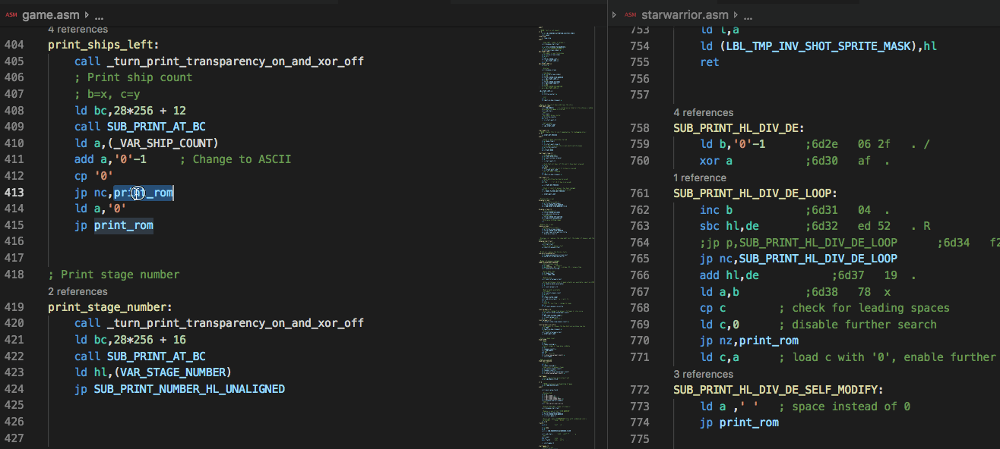
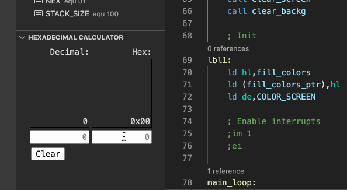
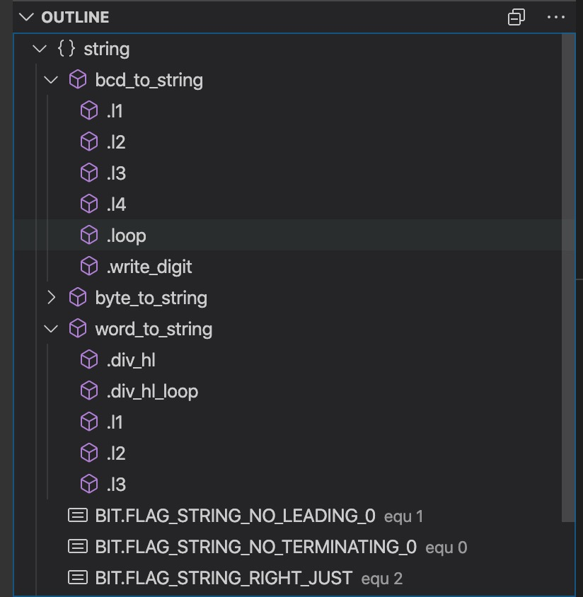

# Support

If you like ASM-Code-Lens please consider supporting it.

<a style="background-color:Goldenrod" href="https://www.paypal.com/cgi-bin/webscr?cmd=_s-xclick&hosted_button_id=8S4R8HPXVCXUL&source=url" target="_blank">Donate via PayPal</a>

# ASM Code Lens

'ASM Code Lens' is a language server extension for Visual Studio Code for assembler files.
It provides support for:
- Assembler syntax highlighting.
- Completions: While you type completions are proposed based on the labels in your asm files.
- "Find all references": through a right mouse click in your assembler source file. It will come up with all found references in the other files.
- Hovering: When hovering over  symbol it shows the comments for the symbol.
- Outline view: View your labels (code, data, constants) in the outline view.
- Rename symbols.
- Code Lens: Above symbols it shows the number of references. You can click it to get to the references.
- Command: asm-codspec
e-lens.find-labels-with-no-reference to find all labels that are not EQU and are not referenced. Useful to find dead code.
- Supports e.g. sjasmplus (with dot notation, also MODULE and STRUCTs), Savannah's z80asm, z88dk assembler and many other assemblers that use a standard notation for labels (e.g. "label:").

Please refer to the "Feature Contributions" tab to see how to enable/disable certain features

## Installation

Install through Visual Studio Code Marketplace.
The extension is called "ASM Code Lens".

It supports the following assembler file suffixes by default:
.asm, .s, .inc, .a80.
Others are configurable.

## Hexadecimal Calculator

A view in the sidebar of the explorer and in debug mode.
It adds a decimal and hexadecimal calculator to vscode.
It always shows 2 columns: decimal and hexadecimal.
If you enter a number in one column it is automatically converted to the other type.

This way it is easily possible to mix calculations between decimal and hexadecimal.

The calculator allows the basic integer calculations:
- addition
- subtraction
- multiplication
- division

## Outline View

An outline view of the assembly can be shown like this:

"ASM Code Lens" uses some heuristics to tell what labels are data, const or code.
So be aware that it's decision might be wrong sometimes.

Note: The outline view also supports sjasmplus MODULE information.

## Problem Matcher

For the [sjasmplus](https://github.com/z00m128/sjasmplus) assembler there is a problem matcher included to ease navigation to compile errors.

You can use it simply by adding this to your tasks.json:
~~~
"problemMatcher": "$problem-matcher-sjasmplus",
~~~

# Hovers in Debug Mode

vscode turns the normal hovers off if in debug mode. To make them visible press the "ALT" key while hovering.

## Known Issues

- [CodeLens lifetime #57227](https://github.com/Microsoft/vscode/issues/57227): Updates of the CodeLens is not working optimal. At the moment it is necessary to reload or save the file to update the CodeLens info.
- This extension doesn't use a structured approach but just looks at all asm files without hierarchy. This means that sjasmplus MODULE definitions are only taken into account if they are used within the same file.

## License and Acknowledgements

ASM-Code-Lens is licensed under the [MIT license](https://github.com/maziac/dezog/blob/master/LICENSE.txt).

This extension made use of code from 2 other packages:
- [find all references](https://github.com/gayanhewa/vscode-find-all-references) by gayanhewa, MIT License
- [grob](https://www.npmjs.com/package/grob) by jamiebuilds, MIT License
- [vscode-whats-new](https://github.com/alefragnani/vscode-whats-new) project from Alessandro Fragnani aka [alefragni](https://github.com/alefragnani), MIT License

I also included the grammar for syntax highlighting from Martin Bórik's vscode extension [z80-macroasm-vscode](https://github.com/mborik/z80-macroasm-vscode) because I got problems when running both extensions at the same time and I could not turn off features selectively.
I.e. I copied the files language.configuration.json and z80-macroasm.tmLanguage.json. The z80-macroasm-vscode extension itself was forked from Imanol Barriuso's vscode extension [z80asm-vscode](https://github.com/Imanolea/z80asm-vscode). MIT license, copyright (c) 2016 Imanol Barriuso (Imanolea).

Many thanks to the authors.
